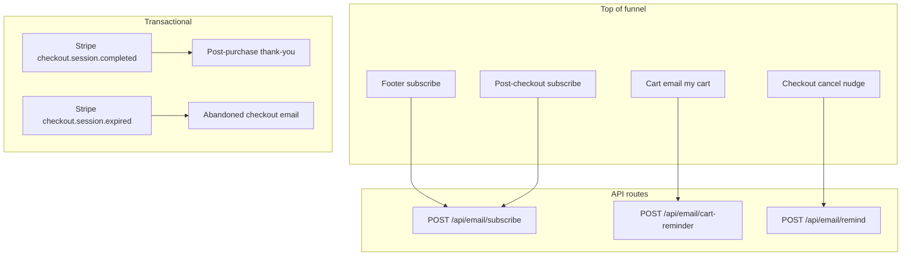

# Smash Wraps — email flows

Transactional and marketing email is sent with **Resend** when `RESEND_API_KEY` and `RESEND_FROM_EMAIL` are set (verified domain). Without them, API routes return `200` with `configured: false` so the site stays usable in dev.

## TRIBE v2 + MiroFish alignment (website email)

Templates in `lib/email/templates/transactional.ts` are written for the same **website** cohorts as `config/mirofish-tribev2-portfolio-audit.json`: reduce **trust_barriers** (Stripe named, policy links in shell + body), **cognitive_load** (short paragraphs, one primary CTA), **onboarding_ambiguity** (what happens next: receipt, where to get help), and **mobile-first** recovery (cart email explains phone path). **B2B** gets a single **About** line in welcome; **compliance** keeps 21+ and no unverified claims.

**Automation:** When Mission Control is up, you can still queue a broader pass with `docs/SWARM-SEO-RUNBOOK.md` / `POST /api/goal` from `claw-architect` root.

## Environment

| Variable | Purpose |
|----------|---------|
| `RESEND_API_KEY` | Resend API key (Dashboard → API Keys). |
| `RESEND_FROM_EMAIL` | Verified sender, e.g. `Smash Wraps <orders@yourdomain.com>`. |
| `NEXT_PUBLIC_SITE_URL` | Canonical URL for links in email (`?cart=` recovery, shop links). |

See root `docs/EMAIL_RESEND_MIGRATION.md` for domain verification.

**Delivery webhooks:** `POST /api/webhooks/resend` verifies **Svix** signatures using `RESEND_WEBHOOK_SECRET` (`whsec_…` from the Resend webhook). Add the same URL in Resend (e.g. `https://smashcones.com/api/webhooks/resend`) and set the secret in Vercel env. Do not commit secrets.

## Flow map

### “Agency-grade” triggers now in code

| Trigger | What fires | Idempotency |
|---------|------------|-------------|
| Paid order | `checkout.session.completed` → branded thank-you + line recap | Resend key `stripe_evt_<id>_post_purchase` (retries don’t duplicate) |
| Checkout expired | `checkout.session.expired` → same cart HTML as manual reminder, copy explains **session timed out / no charge** | `stripe_evt_<id>_abandoned_checkout` |
| Manual cart email | User submits email in cart drawer | — |
| Cancel page | User submits email on `/checkout/cancel` | — |

**Stripe Dashboard:** Add **`checkout.session.expired`** to the webhook (same endpoint as `checkout.session.completed`). Connect: listen on connected accounts if checkout runs on Connect.

**Not included (typical Klaviyo / Iterable scope):** multi-step drips (1h/24h/72h), segments, A/B tests — need external automation or a job store + Postgres.

## Messages

| Trigger | Template | Purpose |
|---------|----------|---------|
| Subscribe (footer, success, cart source tag) | Welcome HTML | Double opt-in not implemented; add Resend Audience or third-party if you need compliance in EU. |
| Cart “Email my cart” | Cart reminder + `/?cart=` recovery link | Abandonment recovery; one-shot per user action. Drip sequences (1h / 24h) need a queue + DB or Klaviyo. |
| Cancel page “Email me” | Soft return / shop CTA | Win-back after Stripe Checkout abandoned. |
| `checkout.session.completed` (paid) | Order thank-you + line recap | Brand layer on top of Stripe receipt; idempotent per webhook retry (may duplicate if Resend retries — add DB idempotency later). |

## Cart recovery

`lib/cart-recovery.ts` encodes allowed SKU lines as **base64url** JSON. Links look like:

`https://yoursite.com/?cart=...`

`CartRecoveryHandler` hydrates the cart once and removes the query param.

## Stripe webhook

Ensure the platform webhook receives **`checkout.session.completed`** from **connected accounts** if using Connect (Dashboard → Webhooks → “Listen to events on Connected accounts”). Handler: `app/api/webhooks/stripe/route.ts`.

## Going beyond this repo

- **Drip / segmentation:** Resend Broadcasts, Klaviyo, or Postscript — sync contacts from subscribe API (server-side) once legal review is done.
- **Abandoned Stripe Checkout without site email:** only Stripe can email if the user entered email on Checkout; consider **Checkout email collection** + Stripe’s customer email — still no native “abandoned cart” email without Klaviyo/Orchestration.
- **Somavea / other DTC references:** use the same patterns — footer capture, post-purchase list growth, transactional clarity. The Somavea storefront repo was not in this workspace; patterns mirrored standard supplement DTC (trust, capture, recovery).
